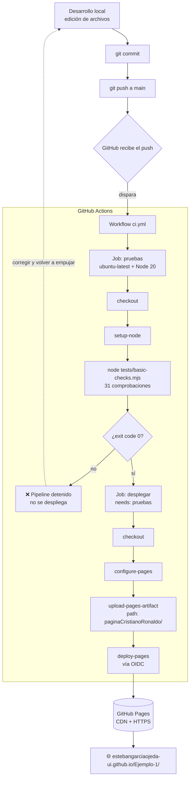

# CI/CD — Flujo completo hasta GitHub Pages

Documento de referencia del proceso de integración y despliegue continuo del
proyecto **Ejemplo-1** (sitio estático sobre Cristiano Ronaldo).

- **Repositorio:** <https://github.com/estebangarciaojeda-ui/Ejemplo-1> · rama `main` · público
- **Sitio publicado:** <https://estebangarciaojeda-ui.github.io/Ejemplo-1/>
- **Dashboard de observabilidad:** <https://estebangarciaojeda-ui.github.io/Ejemplo-1/observabilidad.html>
- **Workflow:** [`.github/workflows/ci.yml`](.github/workflows/ci.yml)
- **Pruebas:** [`tests/basic-checks.mjs`](tests/basic-checks.mjs)

---

## 1. Visión general

Todo el ciclo es **sin servidor de aplicaciones y sin dependencias externas**: se
publica HTML/CSS/JS estático. GitHub aporta las tres piezas del pipeline.

| Pieza | Rol en el pipeline | Dónde se configura |
| --- | --- | --- |
| **Repositorio Git (GitHub)** | Fuente de la verdad. Cada `push` a `main` dispara el pipeline. | El propio repo + `.gitignore` |
| **GitHub Actions** | Motor de CI/CD. Ejecuta las pruebas y, si pasan, construye y despliega. | `.github/workflows/ci.yml` |
| **GitHub Pages** | Hosting estático. Recibe un artefacto de Actions y lo sirve por HTTPS. | Ajuste único en *Settings → Pages* + pasos del workflow |

### Diagrama del flujo



### Resumen en una frase

> `push` a `main` → **Actions** ejecuta 31 pruebas → si **todas pasan**, empaqueta la
> carpeta `paginaCristianoRonaldo/` y la entrega a **Pages** → la web queda online en
> `https://estebangarciaojeda-ui.github.io/Ejemplo-1/`.

---

## 2. El repositorio

### 2.1 Estructura relevante para CI/CD

```
Ejemplo-1/
├── .github/
│   └── workflows/
│       └── ci.yml                 # definición del pipeline
├── tests/
│   └── basic-checks.mjs           # pruebas (Node puro, sin dependencias)
├── paginaCristianoRonaldo/        # ← ESTO es lo que se publica en Pages
│   ├── index.html
│   ├── styles.css
│   ├── script.js
│   ├── observabilidad.html
│   ├── observabilidad.css
│   ├── observabilidad.js
│   ├── assets/                    # 9 imágenes JPEG
│   ├── .nojekyll                  # desactiva el procesado Jekyll de Pages
│   ├── AUDITORIA.md
│   └── OBSERVABILIDAD_GUIA.md
├── .gitignore
└── CI-CD.md                       # este documento
```

Punto clave: **el sitio vive en una subcarpeta** (`paginaCristianoRonaldo/`), no en
la raíz. El workflow publica solo esa carpeta, así que la documentación (`*.md`,
`tests/`, `.github/`) queda versionada pero **no** se sube a la web.

### 2.2 Ramas y disparo

| Evento en el repo | Qué ocurre |
| --- | --- |
| `push` a `main` | Se ejecutan **pruebas + despliegue**. |
| `pull_request` hacia `main` | Se ejecutan **solo las pruebas** (no se publica). |
| Ejecución manual (*Actions → Run workflow*) | `workflow_dispatch`: pruebas + despliegue. |

### 2.3 Convención de commits

Mensaje corto en imperativo + cuerpo opcional. Los commits generados con asistencia
llevan el *trailer* `Co-Authored-By:`.

Historial hasta la puesta en marcha del pipeline:

| Commit | Contenido |
| --- | --- |
| `214ea2b` | Commit inicial: sitio + observabilidad. |
| `d538e0e` | Alta del pipeline: `ci.yml` + `tests/basic-checks.mjs` + `.nojekyll`. |
| `6194ca0` | Commit vacío para relanzar el despliegue tras activar Pages. |

---

## 3. GitHub Actions (detalle)

Todo el comportamiento está en un único archivo declarativo:
[`.github/workflows/ci.yml`](.github/workflows/ci.yml).

### 3.1 Cabecera: disparadores, permisos y concurrencia

```yaml
name: CI y despliegue a GitHub Pages

on:
  push:
    branches: [main]
  pull_request:
    branches: [main]
  workflow_dispatch:

permissions:
  contents: read      # leer el código en el checkout
  pages: write        # crear/actualizar el sitio de Pages
  id-token: write     # obtener un token OIDC para deploy-pages

concurrency:
  group: pages
  cancel-in-progress: false
```

| Bloque | Por qué está así |
| --- | --- |
| `on.push.branches: [main]` | Solo `main` publica. Ramas de trabajo no tocan producción. |
| `on.pull_request` | Un PR ejecuta las pruebas como *quality gate* antes de fusionar, sin desplegar. |
| `on.workflow_dispatch` | Permite relanzar el pipeline a mano desde la pestaña *Actions*. |
| `permissions` | Se concede al `GITHUB_TOKEN` **solo lo mínimo**. `pages: write` + `id-token: write` son obligatorios para publicar en Pages con el método moderno. |
| `concurrency.group: pages` | Si llegan dos push seguidos, los despliegues se **serializan**. |
| `cancel-in-progress: false` | No se aborta un despliegue a medias (dejaría Pages en estado incoherente). |

### 3.2 Job 1 — `pruebas` (fase CI)

```yaml
jobs:
  pruebas:
    name: Pruebas básicas
    runs-on: ubuntu-latest
    steps:
      - name: Descargar el código
        uses: actions/checkout@v4

      - name: Preparar Node.js
        uses: actions/setup-node@v4
        with:
          node-version: '20'

      - name: Ejecutar comprobaciones (sintaxis JS, estructura, accesibilidad, enlaces)
        run: node tests/basic-checks.mjs
```

| Paso | Acción | Resultado |
| --- | --- | --- |
| 1 | `actions/checkout@v4` | Clona el repo en el runner efímero. |
| 2 | `actions/setup-node@v4` (Node 20) | Deja `node` disponible en el `PATH`. |
| 3 | `node tests/basic-checks.mjs` | Ejecuta las pruebas. **Exit `0`** → job en verde. **Exit `1`** → job en rojo y el pipeline se para (el job de despliegue tiene `needs: pruebas`). |

#### Qué valida `tests/basic-checks.mjs` (31 comprobaciones, sin dependencias)

| Grupo | Comprobaciones |
| --- | --- |
| **Archivos obligatorios** | Existen `index.html`, `styles.css`, `script.js`, `observabilidad.html`, `observabilidad.css`, `observabilidad.js`. |
| **Sintaxis JavaScript** | `node --check` sobre **todos** los `.js` de la carpeta del sitio (`script.js`, `observabilidad.js`). |
| **`index.html` — estructura** | Existen los *landmarks* `<header>`, `<nav>`, `<main>`, `<footer>`; hay **exactamente un** `<h1>`. |
| **`index.html` — IDs** | Todos los `id` son únicos (sin duplicados). |
| **`index.html` — enlaces internos** | Cada `href="#ancla"` apunta a un `id` existente. |
| **`index.html` — ARIA** | Cada `aria-controls` y `aria-labelledby` referencia un `id` existente. |
| **`index.html` — imágenes** | Toda `` tiene `alt` no vacío (excepto el visor dinámico `#visor-imagen`). |
| **`index.html` — recursos** | Cada `src`/`href`/`data-imagen` local (`.css`, `.js`, imágenes) apunta a un archivo que existe en disco. |
| **`index.html` — scripts** | `script.js` y `observabilidad.js` están enlazados. |
| **`observabilidad.html`** | IDs únicos; existen los botones `#btn-actualizar`, `#btn-demo`, `#btn-descargar`, `#btn-limpiar`; sin rutas absolutas `"/…"` (romperían bajo `/Ejemplo-1/`). |
| **`observabilidad.js` — contrato** | Expone `getSnapshot()`; publica `window.CR7Observability`; la clave de `localStorage` empieza por `cr7-observability`; no queda la variable `elemento` (bug ya corregido). |

Salida esperada (cola):

```
--------------------------------------------------
RESULTADO: OK — 31 comprobaciones, 0 fallos
```

### 3.3 Job 2 — `desplegar` (fase CD)

```yaml
  desplegar:
    name: Publicar en GitHub Pages
    needs: pruebas
    if: github.ref == 'refs/heads/main' && github.event_name != 'pull_request'
    runs-on: ubuntu-latest
    environment:
      name: github-pages
      url: ${{ steps.deployment.outputs.page_url }}
    steps:
      - uses: actions/checkout@v4

      - name: Configurar GitHub Pages
        uses: actions/configure-pages@v5
        with:
          enablement: true

      - name: Empaquetar el sitio (carpeta paginaCristianoRonaldo)
        uses: actions/upload-pages-artifact@v3
        with:
          path: paginaCristianoRonaldo

      - name: Desplegar
        id: deployment
        uses: actions/deploy-pages@v4

      - name: Mostrar la URL publicada
        run: echo "Sitio publicado en ${{ steps.deployment.outputs.page_url }}"
```

| Elemento | Explicación |
| --- | --- |
| `needs: pruebas` | Este job **no arranca** si `pruebas` no ha terminado en verde. Es la puerta de calidad. |
| `if: github.ref == 'refs/heads/main' && github.event_name != 'pull_request'` | Doble seguro: solo publica en `main` y nunca desde un PR. |
| `environment: github-pages` | Vincula el job al *environment* `github-pages`. GitHub añade automáticamente una regla que restringe el despliegue a la rama por defecto. La URL final aparece en la pestaña *Environments* del repo. |

Pasos:

| # | Paso | Qué hace | Por qué |
| --- | --- | --- | --- |
| 1 | `actions/checkout@v4` | Vuelve a clonar el repo (job independiente = runner nuevo). | Necesita los archivos para empaquetarlos. |
| 2 | `actions/configure-pages@v5` (`enablement: true`) | Consulta la API de Pages y, si el sitio no existe, intenta **activarlo**. Devuelve metadatos (URL base, etc.). | Evita el paso manual… **cuando la cuenta lo permite** (ver §4.1). |
| 3 | `actions/upload-pages-artifact@v3` (`path: paginaCristianoRonaldo`) | Empaqueta esa carpeta en un artefacto `.tar.gz` llamado **`github-pages`** con los permisos que espera el servicio de Pages. | Es el "paquete" que Pages va a servir. Solo la subcarpeta → la web no incluye `tests/`, `.md`, etc. |
| 4 | `actions/deploy-pages@v4` (`id: deployment`) | Pide un **token OIDC** (de ahí `id-token: write`), le dice al servicio de Pages "publica el artefacto `github-pages` de este run" y espera a que termine. Expone `outputs.page_url`. | Es el despliegue real. Sin servidores propios: Pages descarga el artefacto y lo sirve. |
| 5 | `echo …page_url` | Deja la URL en el log del run. | Trazabilidad. |

### 3.4 Acciones de terceros utilizadas

| Acción | Versión | Función |
| --- | --- | --- |
| `actions/checkout` | `v4` | Clonar el repositorio en el runner. |
| `actions/setup-node` | `v4` | Instalar Node.js 20. |
| `actions/configure-pages` | `v5` | Detectar/activar Pages y exponer su configuración. |
| `actions/upload-pages-artifact` | `v3` | Crear el artefacto `github-pages` con el contenido del sitio. |
| `actions/deploy-pages` | `v4` | Publicar ese artefacto en el servicio de GitHub Pages. |

> Todas están **ancladas a una versión mayor**. Para máxima reproducibilidad se
> pueden fijar a un SHA concreto.

### 3.5 Matriz de fallos y comportamiento

| Dónde falla | Efecto | Qué revisar |
| --- | --- | --- |
| `node --check` (sintaxis) | Job `pruebas` en rojo; **no se despliega**. La web sigue con la versión anterior. | Log del paso 3; corregir el `.js` y volver a empujar. |
| Comprobación estructural (ID duplicado, `alt` ausente, recurso inexistente, ancla rota…) | Igual que arriba: pipeline detenido. | La línea `FALLO …` del log dice exactamente qué. |
| `configure-pages` (paso 2 del deploy) | Job `desplegar` en rojo; los pasos siguientes quedan `skipped`. | Casi siempre: **Pages no está activado** (ver §4.1). |
| `deploy-pages` (paso 4) | Deploy en rojo. | Estado del servicio de Pages; permisos `pages: write` / `id-token: write`; reglas del *environment* `github-pages`. |
| Todo verde | Web actualizada en 1–2 min. | — |

Historial real: en el run del commit `d538e0e` el job `desplegar` **falló en
`configure-pages`** porque Pages nunca se había activado en el repo. Tras poner
*Source = GitHub Actions* (§4.1) y relanzar (commit `6194ca0`, run
`34370294450`), **ambos jobs pasaron** y la web quedó publicada.

---

## 4. GitHub Pages

### 4.1 Configuración única (manual, una sola vez)

**Settings → Pages → Build and deployment → Source: `GitHub Actions`.**

- No hay que elegir rama ni carpeta: la fuente es el artefacto que sube el workflow.
- Es un ajuste que **el workflow no siempre puede activar solo**. `configure-pages`
  con `enablement: true` lo intenta, pero si la cuenta/organización no autoriza al
  `GITHUB_TOKEN` a crear el sitio, el primer despliegue falla ahí. Una vez hecho el
  cambio a mano, `enablement: true` queda como red de seguridad (idempotente).

### 4.2 Cómo publica Pages

1. `deploy-pages` notifica al servicio de Pages con el ID del artefacto `github-pages`.
2. Pages **descarga y descomprime** el `.tar.gz`.
3. Publica su contenido en la CDN de GitHub, con **HTTPS** y certificado automático.
4. `index.html` de la raíz del artefacto (= `paginaCristianoRonaldo/index.html`) es
   la portada.

### 4.3 URLs resultantes

| Recurso | URL |
| --- | --- |
| Portada | `https://estebangarciaojeda-ui.github.io/Ejemplo-1/` |
| Observabilidad | `https://estebangarciaojeda-ui.github.io/Ejemplo-1/observabilidad.html` |
| Un asset | `https://estebangarciaojeda-ui.github.io/Ejemplo-1/assets/cr7-juventus-2019.jpg` |

Patrón de *project page*: `https://<usuario>.github.io/<repositorio>/`.

### 4.4 Detalles que hacen que funcione en subruta

| Archivo / decisión | Motivo |
| --- | --- |
| Rutas **relativas** en el HTML (`styles.css`, `assets/…`, `observabilidad.js`) | La web cuelga de `/Ejemplo-1/`, no de `/`. Una ruta absoluta `"/styles.css"` daría 404. La prueba de `observabilidad.html` verifica que no haya rutas `"/…"`. |
| `paginaCristianoRonaldo/.nojekyll` | Desactiva el procesado Jekyll: los archivos se sirven **tal cual** (Jekyll ignoraría, por ejemplo, carpetas que empiezan por `_`). |
| Favicon como `data:` URI | No depende de ninguna ruta. |

### 4.5 Caché y propagación

- Primer despliegue tras activar Pages: hasta ~1–2 min en estar disponible.
- Actualizaciones posteriores: normalmente < 1 min.
- La CDN cachea; un `Ctrl/Cmd + Shift + R` fuerza recarga si ves contenido viejo.

---

## 5. Secuencia extremo a extremo

```text
 1. Editas archivos en paginaCristianoRonaldo/ (o tests/, o el workflow).
 2. node tests/basic-checks.mjs         (opcional, recomendado: probar en local)
 3. git add -A
 4. git commit -m "..."
 5. git push                            (a main)
 6. GitHub detecta el push y lanza el workflow "CI y despliegue a GitHub Pages".
 7. Job "pruebas":
      - checkout  →  setup-node@20  →  node tests/basic-checks.mjs
      - si exit != 0  →  ⛔ FIN. La web NO cambia. Vuelves al paso 1.
 8. Job "desplegar"  (solo si el paso 7 fue verde y es push a main):
      - checkout
      - configure-pages
      - upload-pages-artifact  (empaqueta paginaCristianoRonaldo/ → artefacto "github-pages")
      - deploy-pages           (Pages descarga y publica el artefacto vía OIDC)
 9. Pages sirve el contenido por HTTPS en la CDN de GitHub.
10. Web disponible/actualizada en:
      https://estebangarciaojeda-ui.github.io/Ejemplo-1/
```

---

## 6. Ejecutar las pruebas en local

Mismo comando que en CI (solo requiere Node ≥ 18):

```bash
node tests/basic-checks.mjs
echo "exit: $?"        # 0 = OK, 1 = alguna comprobación falló
```

Servir el sitio localmente para revisarlo antes de publicar:

```bash
cd paginaCristianoRonaldo
python -m http.server 8137
#  → http://localhost:8137/
```

---

## 7. Operación

### 7.1 Ver y relanzar ejecuciones

- **Historial:** pestaña **Actions** del repo.
- **Relanzar sin nuevo commit:** abrir el run → *Re-run jobs* / *Re-run failed jobs*.
- **Lanzar a mano:** *Actions → CI y despliegue a GitHub Pages → Run workflow*
  (usa `workflow_dispatch`).

### 7.2 Rollback

El despliegue publica siempre el estado de `main`. Para volver atrás:

```bash
git revert <commit-problemático>
git push
```

El pipeline se ejecuta de nuevo y republica la versión corregida. (Cada despliegue
histórico también queda listado en *Settings → Environments → github-pages*.)

### 7.3 Cómo extender el pipeline

| Objetivo | Cómo |
| --- | --- |
| Añadir un *linter* de HTML/CSS | Nuevo paso en el job `pruebas` (p. ej. `npx html-validate` / `npx stylelint`) tras `setup-node`. Añadir `package.json` si se quieren dependencias fijadas. |
| Comprobar enlaces rotos externos | Paso adicional con una herramienta tipo `lychee` o un script propio. |
| Ejecutar en varias versiones de Node | `strategy.matrix.node-version: [18, 20, 22]` en el job `pruebas`. |
| Entorno de *preview* por PR | Segundo job condicionado a `github.event_name == 'pull_request'` que publique en otro hosting (Pages solo admite un sitio por repo). |
| Cachear dependencias | `actions/setup-node` con `cache: npm` (cuando haya `package-lock.json`). |

---

## 8. Referencia rápida

| Concepto | Valor |
| --- | --- |
| Repo | `estebangarciaojeda-ui/Ejemplo-1` (público, rama `main`) |
| Workflow | `.github/workflows/ci.yml` |
| Pruebas | `tests/basic-checks.mjs` — 31 comprobaciones, sin dependencias |
| Runner | `ubuntu-latest` |
| Node | `20` |
| Carpeta publicada | `paginaCristianoRonaldo/` |
| Disparadores | `push`→`main`, `pull_request`→`main`, `workflow_dispatch` |
| Puerta de calidad | `desplegar` tiene `needs: pruebas` |
| Permisos del token | `contents: read`, `pages: write`, `id-token: write` |
| Config manual única | *Settings → Pages → Source: GitHub Actions* |
| URL pública | <https://estebangarciaojeda-ui.github.io/Ejemplo-1/> |
